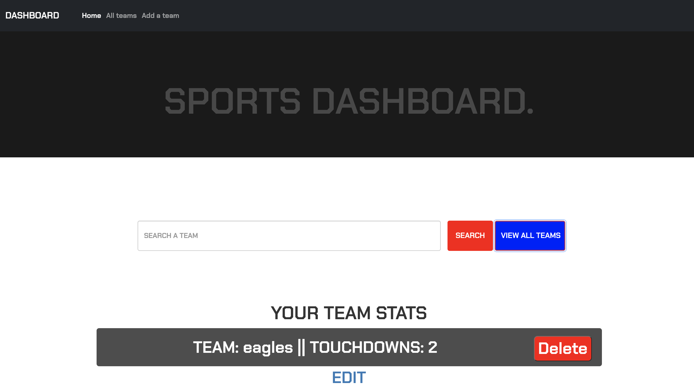
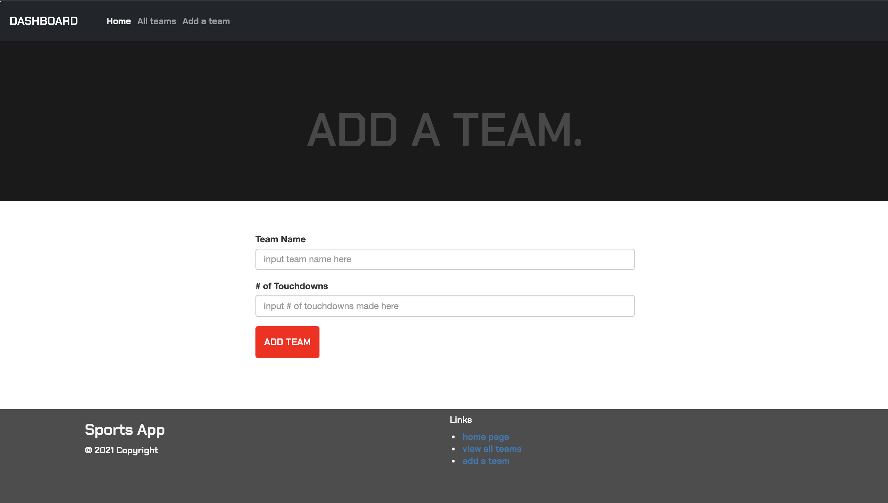

<h1> MySports Dashboard</h1>

<h2>Project Details</h2>

This application uses Express, MySQL, and the MVC design to build a full stack application to allow you to keep track of your favorite football team's touchdowns throughout the season. 

To start the server, simply open the terminal and run: "nodemon server.js" if you have nodemon installed. Otherwise, use "node server.js"

<h2>Images</h2>

Link to the powerpoint presentation:

https://docs.google.com/presentation/d/17V3PV3ZgT_olR16W7gHxA4slUKoIW8VtD9jzaKNBeV4/edit#slide=id.gb916137ca5_0_64

<h2>Questions</h2>

Github username: lhutchinson22

For a look at my repositories click this link: https://github.com/lhutchinson22

You can reach me at my email address: lbhutchinson022@gmail.com, if you have any questions at all!

